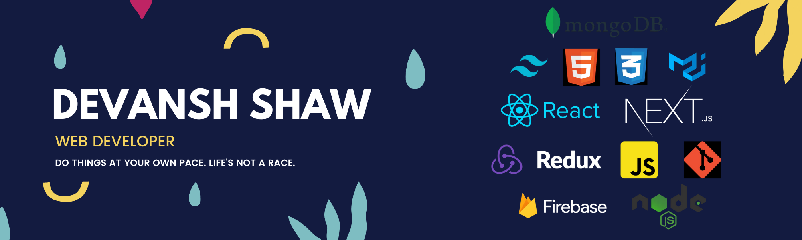

# Hi 👋 My name is Devansh Shaw

<!--  -->

 
   

## About Me

I’m **Devansh**, a Final year **B.Tech CSE**, undergraduate student at **Kalinga Institute of Industrial Technology, BBSR, India.** 🎓
I'm a passionate **full-stack web developer** and a **competitive coder**. If I talk about my professional experience, I am currently working as **Software Engineer Intern @ General Elecric Healthcare**, and previously I've worked as **SDE Intern @ HighRadius** (worked on React JS, Python, Machine Learning, Java, JDBC, Servlet and MySql). Apart from this, I love being part of different communities and engaging myself in different community works.

 
- 🌍  I'm based in Kolkata, West Bengal, India.
   
- 🖥️  Know more about me at [https://devansh-shaw.netlify.app/.](https://devansh-shaw.netlify.app/)

<!-- - 🔭 I’m currently working on a website related to Mental Awarness. -->

- 🌱 I’m currently learning Typescript, Angular JS, and Springoot.
   
- 👯 I’m looking to collaborate on projects related to Web Development.

- 📫 You can reach me at akashshaw8783@gmail.com

- ⚡ Fun fact: Very Curious
   
<!--NOMINATION FOR STAR GIT LINK CODE-->
<a href="https://stars.github.com/nominate/">You love what you see , Nominate me for GitHub Star </a>

## 📫 Find me on:

<table>
  <tr>
    &nbsp;&nbsp;&nbsp;&nbsp;
    &nbsp;&nbsp;&nbsp;&nbsp;
<!--      -->
    
<!--   &nbsp;&nbsp; 
  &nbsp;&nbsp;
  &nbsp;&nbsp;
  &nbsp;&nbsp;
  &nbsp;&nbsp; -->
      
     
</table>

## 🧰 Languages and Tools:
<!-- 
  
  
   
   
    
    Data Analysis  
    
   -->

  

## 📈 Github Stats:

   
<!--  -->
   

 

 &nbsp;

 

  
Show some ❤️ by starring some of the repositories!

